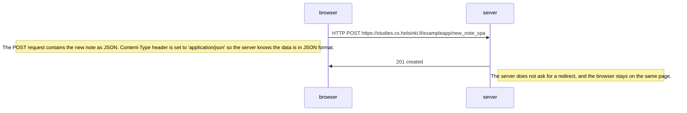

# 0.4: New note

# 0.5: Single page app

# 0.6: New note spa

An event handler listens to the form submit event, prevents the default behaviour (e.preventDefault()) of form submit, creates a new note and adds it to the notes list, renders it on the page and sends the new note to the server.
